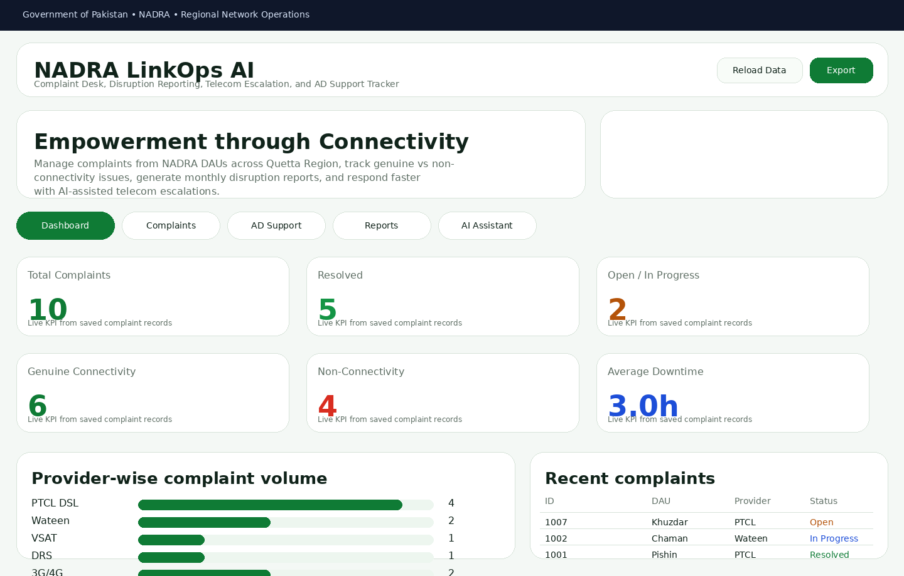
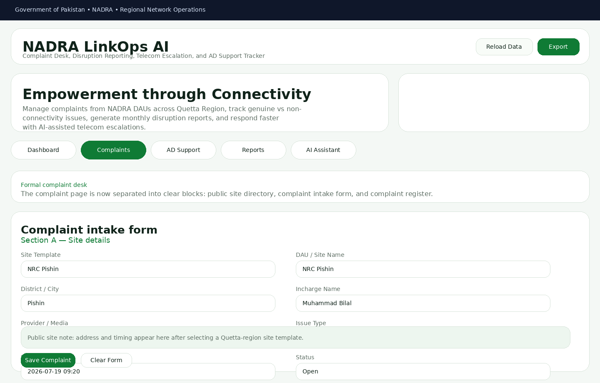
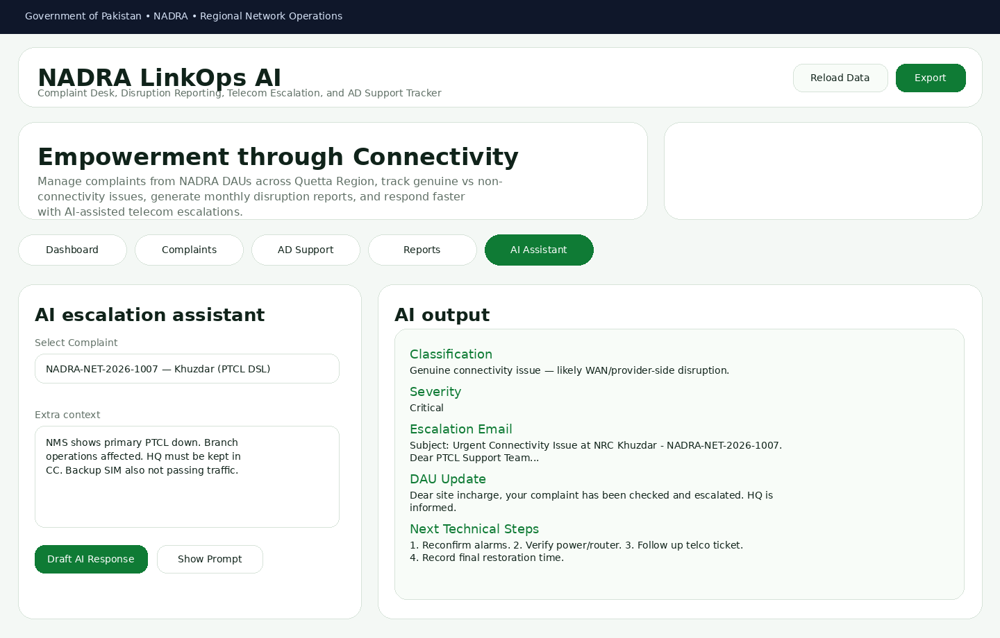
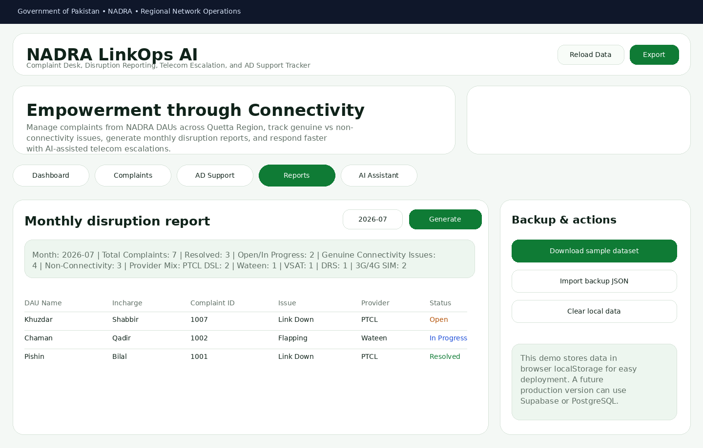

# NADRA Network Complaint Management System (RHO Quetta Region)

**NADRA Network Complaint Management System (RHO Quetta Region)** is a complete final-project web app built around a **real operational problem in Pakistan**.
It helps a Network Engineer in **NADRA Quetta Region** track connectivity complaints from DAUs, prepare telecom escalations, log disruption reports, monitor genuine vs non-connectivity issues, and manage **Active Directory support requests** like OU transfers, password resets, and account unlocks.

---

## 1) Real problem this app solves

In NADRA's regional network operations workflow, DAU incharges call every day about connectivity issues across multiple sites.
The engineer has to:

- receive complaints,
- check the issue in NMS,
- identify whether the fault is in the **primary** or **secondary** link,
- contact the relevant telecom provider,
- launch complaint tickets and send escalation emails,
- keep HQ informed,
- track which complaints were genuine and which were user-side / LAN / power / false alarms,
- prepare monthly disruption reports,
- and separately manage AD support tasks such as **OU transfer**, **password reset**, and **account unlock**.

Doing all of that manually in notebooks, WhatsApp, or scattered Excel sheets makes reporting and follow-up difficult.

### This app solves that by giving one interface for:
- complaint logging,
- disruption tracking,
- monthly report generation,
- AD support request tracking,
- AI-powered escalation drafting,
- local backup/export/import.

**Target users:**
- NADRA regional network engineers
- IT support / helpdesk staff
- telecom coordination teams
- supervisors/HQ who need disruption visibility

---

## 2) Live deployed URL

> **Replace this with your real Vercel URL before submission:**

**Live URL:** [https://nadra-linkops-ai.vercel.app/]

> Important: the assignment requires a **working public URL**. After deployment, update this section with your real live link.

---

## 3) Public GitHub repository

> **Replace this with your real public GitHub repo before submission:**

**Repository URL:** [https://github.com/your-username/nadra-linkops-ai](https://github.com/mohibbtm-2026/nadra-linkops-ai/)

> Important: make sure the repository is **public**. Test it in incognito mode before submitting.

---

## 4) Features list

### A. Complaint tracking
- Log a complaint from any DAU using a **simplified quick-intake form**.
- Only essential fields are required:
  - DAU name
  - incharge name
  - provider/media
  - issue type
  - disruption start time
  - status
- Advanced details are still available in an optional expandable section:
  - district/city
  - complaint ID launched
  - telecom ticket ID
  - primary/secondary/both link role
  - validated cause
  - resolution time
  - user impact
  - remarks/action taken
- Site template dropdown helps auto-fill Quetta-region sites.
- Includes a separate public-source-based Quetta-region site directory page.
- Public office names/locations are included where available, while incharge names can be filled manually or replaced with internal data.
- Search and filter complaints by status and provider.
- Edit, resolve, and close complaints.
- Separate Balochistan map page with hoverable complaint count markers and clickable site details.
- Admin-managed site directory supporting DAUs, sections, MRV, and project sites.
- Site directory now stores primary media, secondary media, and current bandwidth profile for each site.
- Complaint launch uses the configured site media profile so the wrong unavailable media is less likely to be selected by mistake.
- Export complaints as CSV.

### B. Disruption reporting
- Monthly disruption summary generated from complaint data.
- Shows:
  - total complaints
  - resolved complaints
  - open complaints
  - genuine connectivity complaints
  - non-connectivity / false alarms
  - provider mix
- Printable report view for saving as PDF.
- Monthly CSV export.

### C. Dashboard analytics, alerts, and authority-facing charts
- Total complaints
- Open complaints
- In-progress complaints
- Resolved complaints
- Closed complaints
- Non-connectivity issues
- Status overview chart
- Provider comparison chart
- Monthly complaint trend chart
- Top recurring sites
- Recent complaint and AD request tables
- User access summary
- Critical complaint alerts

### D. Technical task tracker
- Track installation requests
- Track upgradation requests
- Track replacement and fault repair jobs
- Track preventive maintenance jobs
- Cover RHO Quetta sections, Verification Section, project sites, MRV, and DAUs
- Report task origin and task type comparisons
- Export technical tasks as CSV

### E. AD support tracker
- Track OU transfer requests
- Track password reset requests
- Track account unlock requests
- Store HR order references
- Store request date, completion date, and resolution notes
- Export AD requests as CSV

### F. User management
- Admin can create users
- Admin can update users
- Admin can activate/deactivate users
- Role support for Admin, Network Engineer, and Network Technician
- Demo authorization built into the app
- Backend upgrade guide included for secure database-based auth

### G. AI-powered feature
- AI classifies whether a complaint is:
  - genuine connectivity issue, or
  - non-connectivity / local issue
- AI estimates severity
- AI drafts a professional telecom escalation email
- AI drafts a short update for the DAU incharge
- AI suggests next technical troubleshooting steps

### H. Login and access experience
- Includes a **demo login page** for a more complete end-to-end workflow.
- NADRA-inspired visual interface with green/white branding style.
- Session is stored in browser localStorage for demo use.

### I. Backup and restore
- Export full data as JSON backup
- Import JSON backup
- Download sample dataset
- Clear all local demo data

### J. Deployment-friendly design
- No build step required for the frontend
- Can be hosted easily on **Vercel**
- Includes a **serverless AI API function** in `api/ai-draft.js`
- Uses environment variables so secrets are **not committed to GitHub**

---

## 5) AI feature and the instructions behind it

This project includes an AI assistant for real telecom support workflow.

### What the AI does
Given a complaint, it:
1. analyzes the case,
2. decides whether it looks like a genuine connectivity issue,
3. estimates severity,
4. drafts an escalation email to PTCL/Wateen/VSAT/etc.,
5. drafts a short update for the DAU incharge,
6. suggests next troubleshooting steps.

### AI system prompt used in the app

```text
You are NADRA Network Complaint Management System, an assistant for a Network Engineer handling 85 NADRA Data Acquisition Units (DAUs) in Quetta Region, Pakistan.

Your job:
1. Read the complaint context.
2. Decide whether the issue looks like a genuine connectivity issue or a non-connectivity / local issue.
3. Estimate severity.
4. Draft a professional escalation email to the concerned telecom representative, keeping HQ in CC.
5. Draft a short phone update for the DAU incharge.
6. Suggest practical next technical steps the engineer should follow.

Rules:
- Be realistic in Pakistan telecom and public-sector office context.
- Mention DAU name, provider, complaint ID, disruption time, issue nature, and business impact.
- If evidence suggests user-side or LAN issue, clearly say so respectfully.
- Keep the email professional, concise, and action-oriented.
- Output in plain text with these headings only:
  Classification
  Severity
  Escalation Email
  DAU Update
  Next Technical Steps
```

### AI model / provider
The included API function is ready for **OpenRouter-compatible models**.
Examples:
- `openai/gpt-4.1-mini`
- `anthropic/claude-3.5-sonnet`
- `google/gemini-2.0-flash-exp` (if available through your provider)

If no API key is configured, the app still works using a **local fallback draft generator** for demo/testing.

---

## 6) Tools, services, and AI models used

### Core web technologies
- HTML5
- CSS3
- Vanilla JavaScript

### Hosting / deployment
- Vercel

### Version control
- Git
- GitHub (public repository required)

### AI integration
- Vercel Serverless Function (`api/ai-draft.js`)
- OpenRouter-compatible API via `fetch`
- Optional model example: `openai/gpt-4.1-mini`

### Design / documentation assets
- Markdown documentation
- PNG screenshots
- PDF tutorial

---

## 7) Screenshots of the app in action

### Dashboard


### Complaint Register


### AI Assistant


### Monthly Reports


> You can replace these with your own final screenshots after deploying the app.

---

## 8) Folder structure

```text
nadra-linkops-ai/
├── api/
│   └── ai-draft.js
├── assets/
│   └── screenshots/
│       ├── ai-assistant.png
│       ├── complaints.png
│       ├── dashboard.png
│       └── reports.png
├── docs/
│   ├── COMPLETE_PROJECT_GUIDE.md
│   ├── COMPLETE_PROJECT_GUIDE.pdf
│   ├── NADRA_LinkOps_AI_Visual_Tutorial.pdf
│   ├── SOURCES.md
│   ├── SUBMISSION_CHECKLIST.md
│   ├── TUTORIAL.md
│   └── system-prompt.md
├── index.html
├── README.md
├── script.js
├── styles.css
└── vercel.json
```

---

## 9) How to run the project locally

### Option 1 — simplest way
Just open `index.html` in your browser.

### Option 2 — recommended local server
From the project folder, run:

```bash
python -m http.server 8000
```

Then open:

```text
http://localhost:8000
```

---

## 10) How to deploy on Vercel

### Step 1 — push to GitHub
```bash
git init
git add .
git commit -m "Initial commit - NADRA Network Complaint Management System"
git branch -M main
git remote add origin https://github.com/your-username/nadra-linkops-ai.git
git push -u origin main
```

### Step 2 — import into Vercel
1. Sign in to Vercel.
2. Click **Add New Project**.
3. Import your GitHub repository.
4. Deploy.

### Step 3 — add environment variables for AI
In Vercel project settings, add:

- `OPENROUTER_API_KEY` = your secret API key
- `OPENROUTER_MODEL` = `openai/gpt-4.1-mini` (or another supported model)
- `PUBLIC_APP_URL` = your deployed URL

### Step 4 — redeploy
After saving environment variables, redeploy the project so the AI feature works live.

---

## 11) Example real workflow inside the app

### Example complaint
- DAU / Site: NRC Pishin
- Incharge: Muhammad Bilal
- Provider: PTCL DSL
- Link Role: Primary
- Issue: Link Down
- Complaint ID: `NADRA-NET-2026-1001`
- Outcome: escalated to telecom, HQ kept in CC, resolved after restoration

### Example AD support request
- Employee: Ayesha Bibi
- Request Type: OU Transfer
- Old DAU: Quetta Cantt
- New DAU: Zhob
- HR Order: `HQ-HR-Postings-2026-117`

These examples are already included as sample data.

---

## 12) Why this project is original

This is **not** a template clone.
The idea comes from a real job workflow:
- monitoring NADRA DAU links,
- handling telecom complaints,
- tracking outage reports,
- and managing AD support tasks.

The app is specifically adapted to:
- Pakistan telecom providers,
- Quetta Region DAUs,
- government/enterprise escalation workflow,
- HQ CC reporting,
- monthly disruption reporting needs.

That makes it a genuine **real-world original project idea**, which is one of the main grading criteria.

---

## 13) What to update before final submission

Before submitting your final assignment, update these in `README.md`:

- real GitHub repository URL
- real live deployed URL
- your final screenshots (optional but recommended)

Also verify:
- repo is public
- live app opens without login
- AI API key is **not** committed
- the Vercel URL works in incognito mode

---

## 14) Assignment checklist match

This project directly satisfies the assignment requirements:

- ✅ original idea
- ✅ complete functional app
- ✅ AI-powered feature
- ✅ public GitHub-ready structure
- ✅ Vercel deployment-ready structure
- ✅ strong README/report
- ✅ screenshots included
- ✅ tutorial documentation included
- ✅ PDF visual tutorial included

---

## 15) License / academic note

This project is prepared as an **individual academic final project**. You should publish it from **your own GitHub account** and deploy it from **your own Vercel account** before submission.
